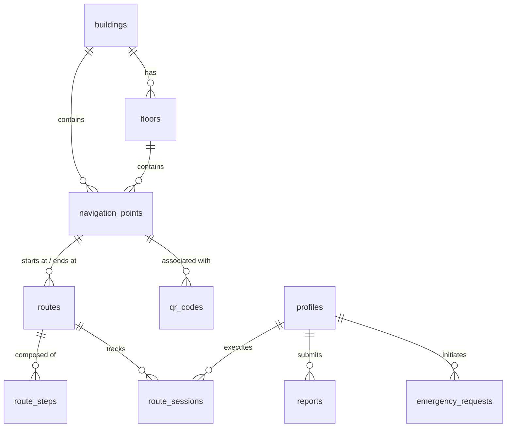

# هيكلية قاعدة البيانات والعلاقات | DATABASE_SCHEMA

يعتمد تطبيق **بصير (Baser)** على قاعدة بيانات **Supabase (PostgreSQL)** لإدارة المباني، المسارات الملاحية، رموز الاستجابة السريعة، البلاغات الميدانية وطلبات الاستغاثة.

---

## مخطط العلاقات ومفاتيح الربط (Entity Relationship)

---

## تفاصيل الجداول والأعمدة

### ١. جدول المستخدمين (`profiles`)
يرتبط بجدول المستخدمين الافتراضي لـ Supabase Auth لإدارة تفضيلات المكفوفين الأمنية.
- `id` (uuid, primary key): المعرف الفريد المرتبط بـ `auth.users`.
- `full_name` (text): الاسم الكامل للمستخدم.
- `email` (text): البريد الإلكتروني الجامعي الرسمي.
- `phone` (text): رقم الجوال للتواصل.
- `role` (text): صلاحية الموظف (`super_admin`, `university_admin`, `building_manager`, `support_agent`, `security_staff`, `student`).
- `disability_type` (text, optional): نوع الإعاقة البصرية (كفيف كليًا، ضعيف بصر).
- `emergency_contact_name` (text, optional): اسم جهة الاتصال للطوارئ.
- `emergency_contact_phone` (text, optional): رقم جوال الطوارئ.
- `language` (text): لغة الواجهة التوجيهية الافتراضية (`ar`, `en`).

### ٢. جدول المباني (`buildings`)
- `id` (uuid, primary key): معرف المبنى.
- `name_ar` / `name_en` (text): اسم المبنى باللغتين العربية والإنجليزية.
- `description_ar` / `description_en` (text): وصف صوتي للموقع الجغرافي للمبنى وتسهيلاته.
- `type` (text): تصنيف المبنى (`college`, `deanship`, `service`, `administration`, `library`, `restaurant`, `dormitory`, `parking`).
- `latitude` / `longitude` (double precision): الإحداثيات المركزية للمبنى على الخريطة الخارجية.
- `is_accessible` (boolean): هل المبنى مهيأ ومجهز بالكامل لذوي الاحتياجات الخاصة.

### ٣. جدول الطوابق (`floors`)
- `id` (uuid, primary key): معرف الطابق.
- `building_id` (uuid, foreign key): رقم المبنى التابع له الطابق.
- `floor_number` (integer): رقم الطابق (0 للأرضي، 1 للأول، إلخ).
- `name_ar` / `name_en` (text): اسم الطابق المترجم.

### ٤. جدول النقاط الملاحية (`navigation_points`)
تمثل هذه النقاط العقد (Nodes) الأساسية في شبكة الملاحة.
- `id` (uuid, primary key): معرف النقطة.
- `building_id` / `floor_id` (uuid, foreign keys, optional): لربط النقطة بمكان داخلي محدد.
- `name_ar` / `name_en` (text): الاسم المترجم للنقطة المرجعية.
- `type` (text): نوع العقدة (`entrance`, `exit`, `elevator`, `stairs`, `ramp`, `corridor`, `intersection`, `restroom`, `office`, `hall`, `qr_spot`, `hazard`).
- `latitude` / `longitude` (double precision, optional): موقع GPS الخارجي للنقطة.
- `indoor_x` / `indoor_y` (double precision, optional): الإحداثيات الداخلية الثنائية لتوزيع النقاط على خريطة الطابق.
- `audio_instruction_ar` / `audio_instruction_en` (text): نص الإرشاد الصوتي الدقيق الذي ينطق للمكفوفين عند الوقوف عند هذه النقطة.
- `is_hazard` (boolean): هل النقطة تعتبر ممر خطر مؤقت (أعمال صيانة، درج مكسور).

### ٥. جدول المسارات (`routes`)
تربط المسارات العقد والوجهات ببعضها كخطوط مسارات متكاملة.
- `id` (uuid, primary key): معرف المسار.
- `start_point_id` / `end_point_id` (uuid, foreign keys): نقاط البداية والنهاية للمسار.
- `name_ar` / `name_en` (text): اسم المسار ووصفه المترجم.
- `route_type` (text): نوع وتصنيف المسار المفضل (`fastest`, `safe_accessible`, `wheelchair`, `blind_friendly`).
- `distance_meters` (double precision): المسافة الكلية للمسار بالأمتار.
- `estimated_minutes` (double precision): متوسط زمن الوصول التقريبي بالمشي البطيء.

### ٦. جدول خطوات المسار (`route_steps`)
تمثل هذه الخطوات الأطراف (Edges) المرتبة لتوجيه الطالب خطوة بخطوة.
- `id` (uuid, primary key): معرف الخطوة.
- `route_id` (uuid, foreign key): معرف المسار التابع له.
- `step_order` (integer): رقم الخطوة الملاحية في الترتيب المتسلسل.
- `instruction_ar` / `instruction_en` (text): نص التوجيه الصوتي الدقيق للخطوة (مثال: "امشِ للأمام مسافة ٢٠ مترًا").
- `distance_meters` (double precision): مسافة هذه الخطوة المحددة.
- `direction` (text): اتجاه الحركة والالتفاف (`straight`, `left`, `right`, `slight_left`, `slight_right`, `stairs_up`, `stairs_down`, `elevator_up`, `elevator_down`).
- `haptic_pattern` (text): نمط اهتزاز الجوال المطلوب تشغيله عند بداية هذه الخطوة (`continue`, `turn_left`, `turn_right`, `warning`, `arrived`).

### ٧. جدول رموز الاستجابة السريعة (`qr_codes`)
- `id` (uuid, primary key): معرف الرمز.
- `navigation_point_id` (uuid, foreign key): النقطة الملاحية المرتبطة بالملصق الورقي.
- `code` (text, unique): الرمز النصي المشفر المدعوم في التطبيق (مثال: `baser://point/{uuid}`).
- `scan_count` (integer): إجمالي عدد مرات مسح الرمز.

### ٨. جدول البلاغات الميدانية (`reports`)
- `id` (uuid, primary key): معرف البلاغ.
- `report_type` (text): نوع العائق المكتشف (`obstacle`, `closed_door`, `broken_elevator`, `maintenance_work`, `crowded`, `qr_issue`, `routing_issue`).
- `title` / `description` (text): عنوان ووصف البلاغ التفصيلي.
- `status` (text): حالة البلاغ الإدارية قيد المتابعة (`new`, `investigating`, `resolved`, `rejected`).
- `admin_note` (text, optional): ملاحظات إدارية من فريق الصيانة.

### ٩. جدول طلبات الاستغاثة الطارئة (`emergency_requests`)
- `id` (uuid, primary key): معرف نداء الطوارئ.
- `latitude` / `longitude` (double precision): الإحداثيات الجغرافية الحية للطالب المستغيث.
- `nearest_point_id` / `nearest_building_id` (uuid, foreign keys): أقرب معلم جغرافي معروف لتسريع وصول دورية الأمن.
- `status` (text): حالة طلب النجدة (`new`, `contacted`, `arrived`, `resolved`).
- `handled_by` (uuid, foreign key): موظف الأمن أو الدعم الذي تولى الاستجابة للطلب.
