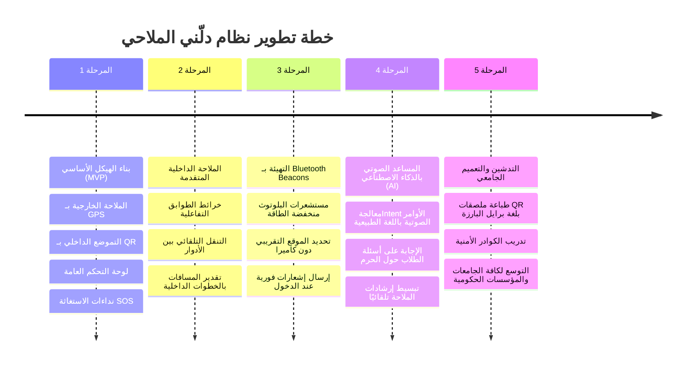

# خطة العمل المستقبلية وتطور المنتج | ROADMAP

يوضح هذا المستند خطة التوسع المستقبلية لتطبيق **دلّني (Dallni)** للانتقال من مرحلة النسخة التجريبية الأولى (MVP) إلى نظام ملاحي ذكي شامل ومتكامل.

---

## 🗺️ مراحل تطوير ونمو المنتج

---

## 🔍 تفاصيل المراحل القادمة

### المرحلة الأولى: النسخة الأولى (MVP) - *المرحلة الحالية*
- [x] تأسيس بنية المستودع الموحد (Monorepo).
- [x] بناء الهيكل الأساسي لتطبيق الجوال (React Native Expo) الداعم لقارئات الشاشة.
- [x] بناء خدمات الصوت (`VoiceService`) والاهتزاز اللمسي (`HapticsService`).
- [x] تصميم قاعدة البيانات المتكاملة وهيكلية الجداول الأمنية (RLS) وبيانات التأسيس (Seed).
- [x] إعداد لوحة التحكم الإدارية (Next.js) وتفعيل غرفة نجدة طوارئ SOS واستعراض البلاغات.

### المرحلة الثانية: خرائط الملاحة الداخلية (Indoor Navigation & Map Engine)
- دمج محرك خرائط داخلية مبسط يعرض مخططات الطوابق ثنائية الأبعاد (2D Floor Plans) في لوحة الإدارة.
- تفعيل خاصية التموضع والتبديل التلقائي بين الأدوار (Floor Transition) عند ركوب المصعد أو صعود السلم.
- ربط إحداثيات المشاة بمخططات ثنائية الأبعاد داخل المباني (`indoor_x`, `indoor_y`).

### المرحلة الثالثة: التهيئة بالبلوتوث (Bluetooth Beacons Integration)
- تثبيت أجهزة Bluetooth Low Energy (BLE Beacons) في ممرات الكلية وعند الأبواب الرئيسية والمصاعد.
- ربط التطبيق بحزمة تفاعلية تقوم بالتقاط إشارات البلوتوث وحساب قوة الإشارة (RSSI) لتقدير موقع الكفيف داخل المبنى بدقة بالغة وبدون الحاجة لفتح الكاميرا ومسح QR.
- نطق تنبيهات استباقية فورية (مثال: "أنت تقترب من مدخل بهو كلية الحاسب").

### المرحلة الرابعة: المساعد الصوتي المدعوم بالذكاء الاصطناعي (AI Assistant)
- دمج مساعد ذكي محلي أو سحابي (LLM Client) يستقبل نداءات الطالب الصوتية ويحلل مقصده (Intent Parsing).
- مثال: عندما يقول الطالب: *"وين أقرب دورة مياه مهيأة للكراسي؟"*، يقوم المحرك بربط المقصد بـ `nearest_accessible_restroom` ويبدأ الملاحة فورًا دون نقرات.
- دعم المساعد للإجابة على الأسئلة الإرشادية حول مواعيد التسجيل، مبنى الشؤون، ومواقع القاعات.

### المرحلة الخامسة: التدشين والتشغيل الميداني
- طباعة ملصقات QR الملاحية بلمسات بارزة بلغة **برايل (Braille)** ليتمكن الكفيف من لمسها والعثور عليها لتثبيت موقعه.
- تدريب موظفي الأمن الجامعي والدعم الفني على استخدام لوحة التحكم والاستجابة لإشارات SOS.
- إطلاق التطبيق رسميًا على متاجر التطبيقات (App Store & Google Play) لخدمة طلاب الجامعة.
